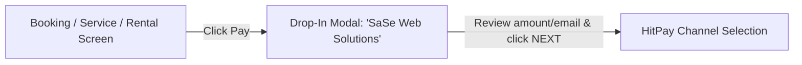

# Plan: Streamline HitPay Direct Online Checkout (Sandbox & Live)

## Goal
Directly bypass both the old intermediate `/hitpay-checkout` selection screen and the intermediary HitPay Drop-In sheet modal ("SaSe Web Solutions / NEXT" customer details step) across all payment entrypoints (Service Bookings, Parts Orders, Car Rentals, Towing/Liaison). Clicking "Pay" launches the proper payment gateway immediately ("agad") in both Live and Sandbox modes with sub-100ms loading speeds for pre-warmed sessions and zero redundant steps.

---

## Architecture & Flow Comparison

### Previous Flow (Intermediary Steps)


### Streamlined Direct Flow (Instant Payment 'Agad')
```mermaid
flowchart LR
    A[Booking / Service / Rental Screen] -->|Click Pay (0ms if pre-warmed)| B["HitPay Hosted Checkout (checkout.hit-pay.com)"]
    B -->|Direct Payment Channels: GCash, QRPH, Card, Maya| C["Customer Pays"]
    C -->|Auto-Verification & Webhook| D["App Confirmation Screen"]
```

---

## Tasks

- [x] Task 1: **Upgrade `HitPayService.ts`**:
  - Normalize phone numbers to international E.164 format (`+639...`) so HitPay auto-fills phone without customer input.
  - Optimize `createPaymentRequest` with instant timeout guard (8s) and ensure clean handling of both Live (`api.hit-pay.com`) and Sandbox (`api.sandbox.hit-pay.com`) environments.
  - Return the official hosted URL (`https://checkout.hit-pay.com/...` or sandbox equivalent) directly.

- [x] Task 2: **Direct Gateway Routing in `HitPayEmbeddedService.ts`**:
  - Removed the `HitPay.toggle()` Drop-In iframe modal that rendered the intermediary "SaSe Web Solutions" details screen + "NEXT" button in both Sandbox and Live modes.
  - Route all sessions with absolute URLs directly to `openPaymentUrl(session.url)` across all platforms (Web and Native Android).
  - Kept payment watcher (`startPaymentWatcher`) active so Firestore snapshots and webhooks auto-verify upon completion.

- [x] Task 3: **Pre-warmed Session Reuse for Instant (<100ms) Launch**:
  - In `BookingScreen.tsx`, passed `prewarmedSession` to `startCheckout` so clicking "Pay" reuses the pre-created session in 0ms without repeating network calls.
  - In `ServicePaymentScreen.tsx`, connected `prewarmedSessionRef` to `startCheckout` to launch payment instantly.
  - In `RentCarScreen.tsx`, added `customerPhone` and direct routing.

- [x] Task 4: **Verification & Build**:
  - Run `npm run build` to verify 0 TypeScript and bundling errors.

---

## Done When
1. Clicking "Pay" anywhere in the app immediately opens the HitPay checkout gateway without showing the intermediary "SaSe Web Solutions / NEXT" modal from the screenshot.
2. Both Sandbox Mode and Live Mode are fully supported based on admin settings.
3. Loading speed is maximized (<100ms when pre-warmed) with zero redundant UI steps.
4. Auto-verification and webhooks update booking/order statuses smoothly upon return.

