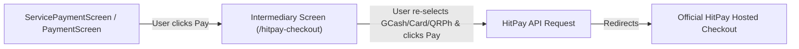
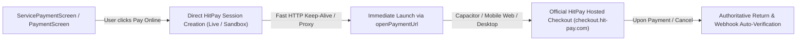

# Plan: Streamline HitPay Direct Online Checkout (Sandbox & Live)

## Goal
Directly remove the intermediate `/hitpay-checkout` selection intermediary screen across all payment entrypoints (Service Bookings, Parts Orders, Car Rentals, Towing/Liaison) so clicking "Pay" generates the official HitPay session immediately (Live or Sandbox depending on active settings) and redirects the customer directly to the official HitPay checkout URL with optimal loading speed and zero redundant steps.

---

## Architecture & Flow Comparison

### Previous Flow (2 Steps)

### Streamlined Direct Flow (1 Step - Instant)

---

## Tasks

- [x] Task 1: **Upgrade `HitPayService.ts`**:
  - Optimize `createPaymentRequest` with instant timeout guard (8s) and ensure clean handling of both Live (`api.hit-pay.com`) and Sandbox (`api.sandbox.hit-pay.com`) environments based on `settings.hitpaySandboxMode`.
  - Pass all customer metadata (name, email, phone, purpose, reference) cleanly.
  - Return the official hosted URL (`https://checkout.hit-pay.com/...` or sandbox equivalent) directly.
  → Verify: `HitPayService.createPaymentRequest` resolves the authoritative checkout URL without redirecting to `/hitpay-checkout`.

- [x] Task 2: **Streamline `pages/ServicePaymentScreen.tsx`**:
  - In `handleProcessPayment`: Directly call `hitPay.createPaymentRequest(...)` when HitPay Online is selected.
  - Show a smooth, branded loading state (`"Connecting to HitPay Secure Gateway..."`) with spinning indicator.
  - Call `await openPaymentUrl(checkoutUrl)` immediately upon session creation, bypassing the intermediate screen entirely.
  - Save pending transaction state in `sessionStorage` beforehand so return auto-verification proceeds seamlessly.
  → Verify: Clicking "Pay" in `ServicePaymentScreen` directly opens the HitPay payment gateway.

- [x] Task 3: **Streamline `pages/PaymentScreen.tsx`**:
  - In `handlePayment`: Directly call `hitPay.createPaymentRequest(...)` for online orders.
  - Launch via `await openPaymentUrl(checkoutUrl)` immediately.
  - Retain fallback to manual GCash modal only if network/API fails.
  → Verify: Checkout on parts store orders routes directly to HitPay.

- [x] Task 4: **Streamline Other Booking Flows** (`RentCarScreen.tsx`, `LiaisonBookingFlow.tsx`, `DriverBookingFlow.tsx`, `BookingScreen.tsx`):
  - Audit and ensure any direct payment triggers call `HitPayService` and launch `openPaymentUrl` without navigating to `/hitpay-checkout`.
  → Verify: All service routes have zero intermediate redirects.

- [x] Task 5: **Deprecate / Keep `/hitpay-checkout` as Direct Route Handler**:
  - Retain `/hitpay-checkout` route only as a fallback direct redirector or standalone link handler if accessed directly, auto-forwarding to HitPay.
  → Verify: Direct links to `/hitpay-checkout` gracefully auto-initiate or redirect.

- [x] Task 6: **Verification & Build**:
  - Run `npm run build` to verify 0 TypeScript and bundling errors.
  - Verify speed optimizations (HTTP keep-alive agent, pre-sanitized payloads, instant browser tab / redirect launch).
  → Verify: Build passes cleanly with zero errors.

---

## Done When
1. Clicking "Pay Online" anywhere in the app immediately generates the official HitPay session and launches HitPay checkout without showing the intermediate `/hitpay-checkout` screen from the uploaded screenshot.
2. Both Sandbox Mode and Live Mode are fully respected based on active admin settings.
3. Loading speed is maximized with direct API calls and no redundant UI layers.
4. Auto-verification and webhooks update booking/order statuses smoothly upon return.
