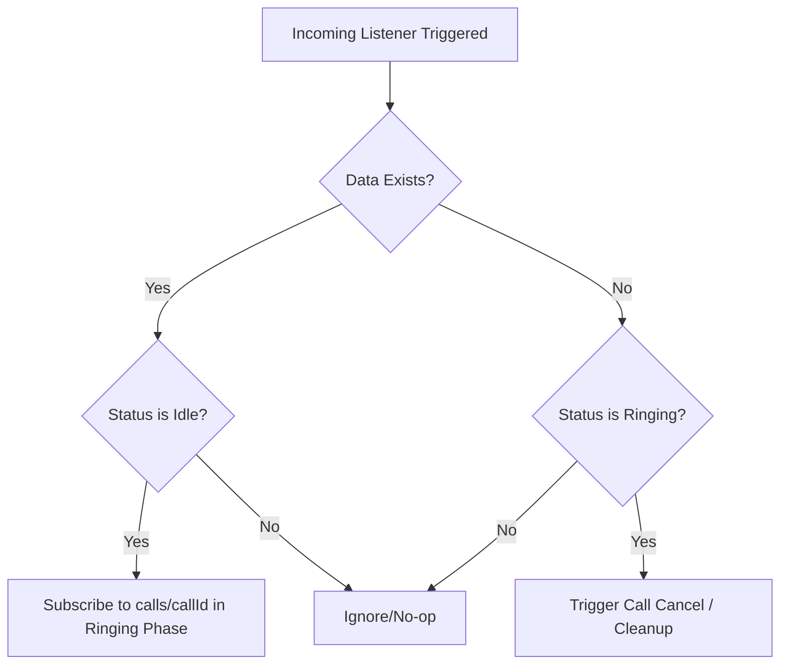

# Implementation Plan - Call Synchronization and Termination Fixes

This plan outlines the changes required to ensure real-time call synchronization and clean termination between Customer and Mechanic in the RidersBUD app.

---

## 1. Problem Statements

1. **Callee Ignores Call Cancellation during Ringing Phase:**
   - In `context/CallContext.tsx` -> `listenForIncomingCalls`, when a call is detected, a one-time `get(callRef)` is used.
   - If the caller cancels the call before the callee answers, the database node `calls/incoming/${userId}` is deleted (becoming `null`), but the callee has no `else` block or listener active on `calls/${callId}` to catch this cancellation. This leaves the callee's UI stuck in the ringing state with the ringtone still playing.

2. **Lack of Real-time Call Subscription on Callee Side during Ringing Phase:**
   - There is no real-time listener (`onValue`) on the call reference `calls/${callId}` before answering. Real-time updates to the call's state (e.g., status changes to `ended`, `declined`, or `missed`) are not synced down to the callee.

3. **Incomplete Call State/WebRTC/Sound Cleanup:**
   - State cleanups for transitions back to `idle` must guarantee that all WebRTC components (`pcRef`, `localStreamRef`, `remoteStreamRef`), stats listeners, state properties (`callStatus`, `callInfo`), and audio playback/sound effects (`callSounds.stop()`) are robustly wiped and stopped.

---

## 2. Proposed Changes

### File: `context/CallContext.tsx`

We will update the incoming call tracking, state subscription, and termination logic:

#### A. Revise `listenForIncomingCalls`
- Maintain a real-time listener (`onValue`) on `calls/incoming/${userId}`.
- If `data` is `null` (or does not contain a `callId`) and `callStatus` is `'ringing'`, the incoming call was cancelled. Call `cleanupPeerConnection()` and reset the call states (`setCallStatus('idle')`, `setCallInfo(null)`, `incomingCallRef.current = null`).
- If a valid `callId` is detected and the local state is `idle`, subscribe to the specific call node in real-time.

#### B. Implement Ringing Phase Call Listener on Callee Side
- When the callee detects a call ID, set up a real-time listener (`onValue`) on `calls/${callId}`.
- Listen for updates:
  - If the call state status is updated to `'ended'`, `'declined'`, or `'missed'`, transition the callee's status to that value, invoke `cleanupPeerConnection()`, and clean up incoming references.
  - Track this subscription using `callListenerUnsubscribeRef.current` so it is safely cleaned up when transitioning or answering.
- When `answerCall()` is executed, ensure any existing ringing-phase listener is safely replaced/cleaned up before subscribing to the active-call updates.

#### C. Solidify state and audio cleanup in `cleanupPeerConnection`
- Guarantee that `callSounds.stop()` is always invoked.
- Stop any ringing or call sound effects explicitly.
- Unsubscribe from active real-time call references.

---

## 3. Step-by-Step Implementation Steps

1. **Step 1: Update `cleanupPeerConnection`**
   - Confirm it clears the `callListenerUnsubscribeRef` listener.
   - Confirm it resets standard and custom streams, WebRTC objects, sound effects, and timers.

2. **Step 2: Refactor `listenForIncomingCalls`**
   - Add the `else` block to handle `data === null` when `callStatus === 'ringing'`.
   - Instead of a one-time `get()` on `calls/${callId}`, create a real-time `onValue` listener on `callRef` (`calls/${callId}`).
   - Save the unsubscribe function for this `onValue` listener to `callListenerUnsubscribeRef.current`.
   - Update caller metadata state when status is `'ringing'`, and if status changes to `'ended'`, `'declined'`, or `'missed'`, execute cleanups immediately.

3. **Step 3: Modify `answerCall` and `declineCall`**
   - Ensure `answerCall` cleanly unsubscribes the ringing-phase listener before opening its own `onValue` connection for the active phase.

4. **Step 4: Verification and Testing**
   - Verify caller canceling before answering stops callee's ringtone and closes modal.
   - Verify caller canceling during a call terminates callee's call cleanly.
   - Verify callee declining updates status immediately on caller side.

---

## 4. Verification Plan

| Scenario | Expected Behavior | Verification Steps |
|---|---|---|
| **Caller cancels call before answer** | Callee ringtone stops immediately; incoming call modal disappears; callee UI resets to `idle`. | 1. Start call from Customer app. 2. Confirm Mechanic app displays incoming call modal and plays ringtone. 3. Click "Cancel/End Call" on Customer app. 4. Check that Mechanic app modal closes and ringtone stops automatically. |
| **Callee declines call** | Caller outgoing ringtone stops; caller UI resets to `idle` or displays `declined`. | 1. Start call from Customer app. 2. Click "Decline" on Mechanic app. 3. Check that Customer app UI updates to reflect call decline. |
| **Abrupt disconnect/unmount** | Remaining active listener triggers and handles cleanup safely. | 1. Start a call. 2. Close the tab or trigger a refresh. 3. Ensure Firebase event cleanup is performed. |
