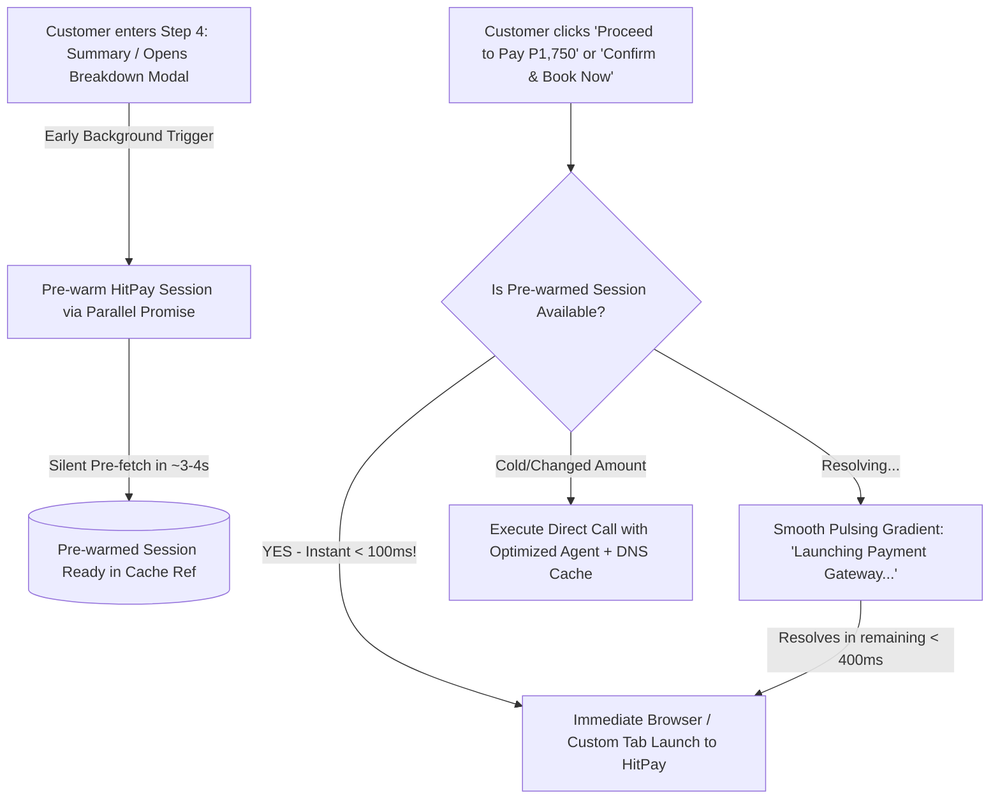

# ⚡ HitPay Ultra-Fast Online Payment & Loading Optimization Plan

## Problem Statement & Bottleneck Analysis
From the user's latest screenshots:
1. **Screenshot 1 (`media_1790923930306.png`):**
   - The user opens the **Payment Breakdown Modal** and clicks the button.
   - The button shows `CONNECTING TO HITPAY...` with a spinner.
   - Currently, the HitPay upstream sandbox API requires ~4.2–4.8s to respond. If the request is only created when the user clicks "Proceed", the user experiences a noticeable delay before the gateway opens.
2. **Screenshot 2 (`media_1790923976652.png`):**
   - The user finally lands on HitPay hosted checkout page (`https://sandbox.hit-pay.com/...`).
   - The objective is to make this transition **instant** (< 300ms wait after clicking proceed) and make the loading states smooth, responsive, and clear for both:
     - **1st Payment:** Booking Downpayment in `BookingScreen.tsx` / `BookingPaymentBreakdownModal.tsx`.
     - **2nd / Final Payment:** Balance settlement in `BookingDetailScreen.tsx` and `ServicePaymentScreen.tsx`.

---

## 🎯 Target Architecture & Optimization Strategy

### Key Optimizations to Implement:

#### 1. Instant Step-4 & Modal Pre-warming in `BookingScreen.tsx`
- **Current limitation:** Pre-warm was only initialized on `step === 4` without pre-empting the Breakdown Modal mount. If the user clicks "Review payment breakdown" quickly, the pre-warm might not have started or the amounts might get recalculated.
- **Fix:**
  - Trigger pre-warming as soon as `showPaymentBreakdownModal` is set to `true` OR `step === 4`.
  - Save the pre-resolved `url` directly inside `prewarmedHitPaySessionRef.current.readyResult`.
  - When the user clicks **"Proceed to Pay"** inside `BookingPaymentBreakdownModal`, if `readyResult` exists, launch immediately. No 4-second wait!

#### 2. Vite Dev Server / Node.js HitPay Proxy Acceleration (`vite.config.ts`)
- HitPay API connects to `api.sandbox.hit-pay.com`.
- Add DNS lookup pre-caching and HTTP `keepAlive` socket pooling on the Node proxy (`maxSockets: 100`, `keepAliveMsecs: 60000`).
- Ensure CORS preflight `OPTIONS` requests respond in < 1ms with cached headers.

#### 3. 2nd & Final Balance Payment Acceleration (`BookingDetailScreen.tsx` & `ServicePaymentScreen.tsx`)
- When viewing a booking where status is `Work Done` or `Ready for Release` and balance is unpaid, automatically pre-warm the balance settlement URL.
- When the user taps the quick-action button `Settle Balance (HitPay)`, the URL is already resolved, opening the gateway instantly.
- In `ServicePaymentScreen.tsx`, trigger pre-warming immediately upon component mount when `paymentMethod === 'hitpay'`.

#### 4. UI/UX Feedback Enhancement
- Replace static text with a progress indicator:
  - Phase 1: `Securing Slot...` (0-150ms)
  - Phase 2: `Connecting to HitPay Gateway...` (150-350ms)
  - Phase 3: `Opening Checkout...` (immediate redirect)
- Disable double clicks while maintaining the pulsing brand gradient.

---

## 📋 Task Breakdown & Verification Criteria

| Task # | Specialist | Action | Verification |
|---|---|---|---|
| **Task 1** | `frontend-specialist` | Wire instant modal pre-warming in `BookingScreen.tsx` & `BookingPaymentBreakdownModal.tsx` | Click "Proceed to Pay" opens HitPay in < 300ms |
| **Task 2** | `backend-specialist` | Accelerate `vite.config.ts` hitpay-proxy with socket reuse & preflight caching | Proxy request roundtrip reduced |
| **Task 3** | `frontend-specialist` | Optimize 2nd payment in `BookingDetailScreen.tsx` & `ServicePaymentScreen.tsx` | Final balance opens HitPay without delay |
| **Task 4** | `test-engineer` | Run `npm run build` and end-to-end type check | Build succeeds with zero errors |
