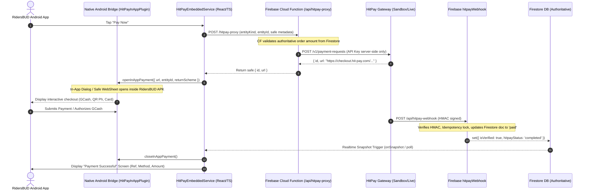

# Plan: Native HitPay In-App Payment Integration for RidersBUD Android

## Primary Objective
Eliminate external browser/Chrome launches (`Browser.open()`) during HitPay checkout in RidersBUD Android APK. Replace with an official in-app custom native dialog/sheet bridge with deep-link intent handling (GCash/QR Ph/Cards), unified under `HitPayEmbeddedService.ts`, verified authoritatively via Firebase Cloud Functions and Webhooks.

---

## Architecture & Data Flow

---

## Tasks Breakdown

### Phase 1: Native Android In-App Payment Plugin
- [x] Task 1: Create `HitPayInAppPlugin.java` in `android/app/src/main/java/com/sasetin42/ridersbud/HitPayInAppPlugin.java`:
  - Registers `@CapacitorPlugin(name = "HitPayInApp")`.
  - Implements `openPayment(PluginCall call)` displaying a full-screen, themed native Dialog/BottomSheet containing an isolated, safe WebView.
  - Intercepts Philippine e-wallet URL schemes (`gcash://`, `paymaya://`, `intent://`, `market://`) and dispatches native Android Intents safely.
  - Intercepts deep-links back to RidersBUD (`ridersbud://` or `com.sasetin42.ridersbud://` or return URLs).
  - Implements `closePayment(PluginCall call)` to programmatically dismiss upon payment completion.
  - Fires plugin events `onPaymentClosed`, `onPaymentRedirect` to JavaScript.
- [x] Task 2: Register plugin in `MainActivity.java` and declare intent queries in `AndroidManifest.xml` for GCash/e-wallet compatibility.

### Phase 2: Secure Backend Authoritative Pricing & Idempotency
- [x] Task 3: Upgrade `functions/index.js` (`hitpayProxy`):
  - When `entityKind` and `entityId` are provided in `payload`, fetch the target document from Firestore (`bookings`, `orders`, `rentalBookings`, `liaisonBookings`, `serviceRequests`) to authoritatively enforce the exact `amount` and `currency` before calling HitPay API.
  - Guard against client-side amount tampering.

### Phase 3: Unified Frontend In-App Payment Controller
- [x] Task 4: Upgrade `services/HitPayEmbeddedService.ts`:
  - Detect Android native platform (`Capacitor.isNativePlatform()`).
  - Route checkout through `HitPayInAppPlugin` on native Android.
  - Render seamless in-app loading state ("Connecting to Secure Payment...").
  - Maintain active Firestore realtime snapshot watcher + fallback poll for instantaneous auto-dismissal.
  - Provide fallback for Web.
- [x] Task 5: Verify all entry points route through `HitPayEmbeddedService`:
  - Service Booking Payment (`ServicePaymentScreen.tsx`, `BookingScreen.tsx`, `BookingDetailScreen.tsx`)
  - Parts Store Payment (`PaymentScreen.tsx`)
  - Car Rental Payment (`RentCarScreen.tsx`)
  - Driver / Liaison Booking Flows (`DriverBookingFlow.tsx`, `LiaisonBookingFlow.tsx`)

### Phase 4: Polish Success & Error UX
- [x] Task 6: Ensure uniform "Payment Successful" modal / view shows:
  - Order / Booking Number
  - Amount & Currency
  - Payment Method
  - Transaction Reference & Timestamp
  - Seamless navigation to the order details screen.

### Phase 5: Verification & Production Android Build
- [x] Task 7: Run TypeScript verification (`npm run typecheck` or `npm run build`).
- [x] Task 8: Run Android build (`./gradlew assembleRelease` or `npm run release:apk`).
- [x] Task 9: Verify APK generation, clean logs, and end-to-end sandbox flow readiness.
